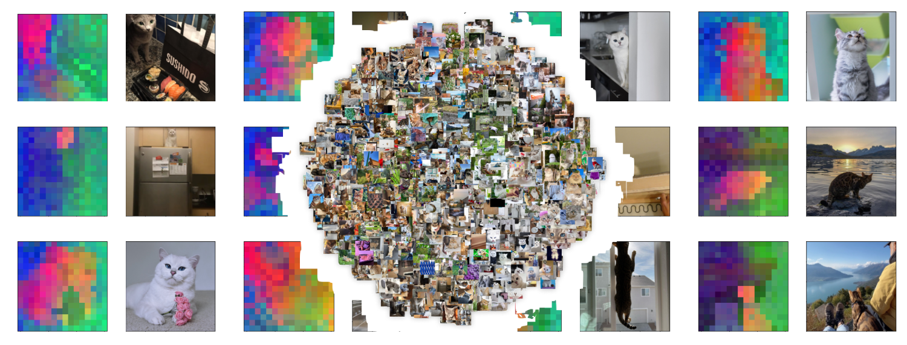

# Individual Cat Clustering

## Installation
To run our main training and plotting code, run `conda create -n cat-clustering --file requirements.txt` in the main directory.

In order to run DINOv2 (for `calculate_embeddings.py`), please first follow the instructions in `dinov2/README.md`. Afterwards, install additional packages with `conda install --file requirements.txt` in the main directory.

## Commands
All scripts are in the `clustering/` directory.

### Embeddings
We calculate the embeddings of our dataset prior to training to save redundant computations. The CLS tokens are saved in this repository, but the patch tokens are too large (10 GB). To generate them, run `python calculate_embeddings.py`.

### Training
To train a clustering model, run `python run_clustering.py`. The training config is in `config/config.yaml`.

To train a K-Means model, run `python run_baseline.py`. The training config is in `config/config_baseline.yaml`

### Visualization
To run one of our visualization scripts, run `python <SCRIPT>.py`. Most of them have arguments and have instructions with `python <SCRIPT>.py --help`. If it asks for an embedding type (`-e`), please enter the name of an embedding file in `embeddings/` (excluding the `.npz` extension). If it asks for a predictions file (`-f`), please enter the path to the `predictions.npy` file within your specific run in `clustering/outputs/`.

- `plot_embeddings.py` generates a t-SNE visualization of the embeddings, colored by label.
- `plot_neighbor_correctness.py` generates a line plot describing the percentage of correct nearest neighbors for each class.
- `plot_patches.py` plots patches per image, colored by PCA decomposition into 3 dimensions.
- `plot_preds.py` plots the predictions of a model, similar to `plot_embeddings.py` but colored by predictions.
- `visualize_dataset.py` loops through pictures in our dataset.

## Dataset
We aggregated cat images from Instagram accounts, totaling 16 individual cats across 10k images.

Our dataset contains 8 different species: bengal, british shorthair, neva masquerade, norwegian forest cat, orange tabby, russian blue, scottish fold, siberian

The following is a breakdown of each cat and its species:

0. aslantheforestcat (norwegian forest cat)
1. cobythecat (scottish fold)
2. fantasticflora (neva masquerade)
3. lemon  (orange tabby)
4. luffylittleleopard (bengal)
5. manduthebengalcat (bengal)
6. mocha (orange tabby)
7. nelsonnthecat (bengal)
8. olivia_bengal (bengal)
9. raythebengalcat (bengal)
10. russianblueleia (russian blue)
11. sterlingsilvercat (siberian)
12. superjoep (british shorthair)
13. thebengalalex (bengal)
14. toki_the_bengal (bengal)
15. umasiberian (neva masquerade)

## Algorithm
Our clustering model is a linear head that predicts classes from DINOv2 embeddings. We train with SCAN loss, which encourages the model to predict similar classes for similar embeddings while maximizing overall prediction entropy. Our implementation can be found in `clustering/core.py`
