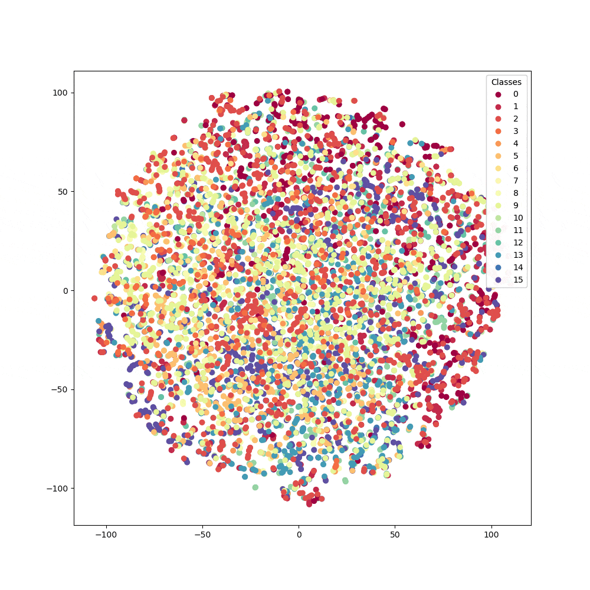

# Individual Cat Clustering

  

## Dataset
We aggregated cat images from Instagram accounts, totaling 16 individual cats across 10k images.

Our dataset contains 8 different species: bengal, british shorthair, neva masquerade, norwegian forest cat, orange tabby, russian blue, scottish fold, siberian

The following is a breakdown of each cat and its species:

0. aslantheforestcat (norwegian forest cat)
1. cobythecat (scottish fold)
2. fantasticflora (neva masquerade)
3. lemon  (orange tabby)
4. luffylittleleopard (bengal)
5. manduthebengalcat (bengal)
6. mocha (orange tabby)
7. nelsonnthecat (bengal)
8. olivia_bengal (bengal)
9. raythebengalcat (bengal)
10. russianblueleia (russian blue)
11. sterlingsilvercat (siberian)
12. superjoep (british shorthair)
13. thebengalalex (bengal)
14. toki_the_bengal (bengal)
15. umasiberian (neva masquerade)

## Algorithm